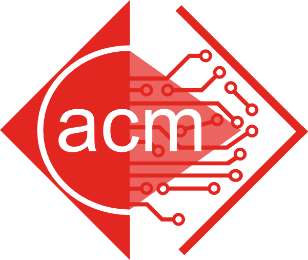

# SigMal

##  _"Security in Development, Development for Security"_

Currently NJIT's premier Special Interest Group for Security under ACM.

## Goal

* Build up interest and skills within Security for NJIT ACM with insight into Malware Analysis and Practical Advice for CTFs

## Traversing the Repo
| Directory                             | Description
|:---:                                 |:----
|[educational_materials](./educational_material)                     | Our meetings slides by semester, and anything that 
|[specific_topics](./specific_topics)   | More advanced stuff and will take a deeper dive into the code / security

