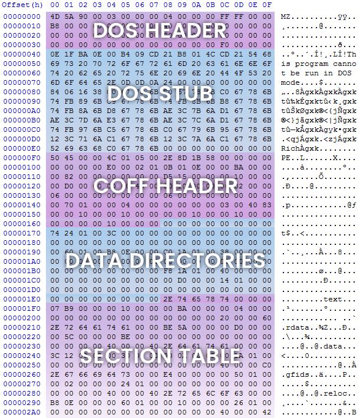
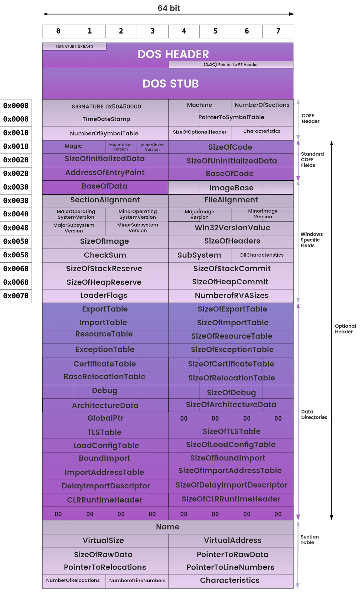

## What are we doing this week?
* **Signatures / Magic Numbers / Hashing**

## Why?
* ~~To flex~~ For doing some really basic static analysis
* Determining file types will help you identify the malware's target OS and architecture 

## Good Commands to know and Use
- `hexdump`
- `xxd`
- `openssl`
    - `shasum`
    - `md5sum`
    - `md5`
- `ssdeep`
- `strings`

## Signatures
### What is a Signature?
* **File Signature** : data used to identify or verify the content of a file
* **Digital Signature** : mathematical scheme for verifying the authenticity of digital messages or documents. A valid digital signature, gives a recipient very strong reason to believe that the message was created by a known sender, and that the messages was not altered in transit.

* CIA ancynoym for Cybersecurity:
    * C -> Confidentality
    * **I -> Integrity**
    * A -> Accessibilty


## Magic Numbers
### What are Magic numbers?
* ~~Magical Numbers that grant wishes~~ Just ways to represent a file at the byte level. -> **Metadata** -> (Basically also the same as File Signtures)
* File Signatures =  Magic Numbers = Magic Bytes
* Check out some [file signatures](https://en.wikipedia.org/wiki/List_of_file_signatures)

### General Location of stuff (in a PE Executable)


### Deep Dive into a PE Executable



## Hashing
### Dare I say it, What is Hashing?
* **Hashing** : is an an algorithm that calculates a fixed-size bit string value from a file . A file basically contains blocks of data. Hashing transforms this data into a far shorter fixed-length value or key which represents the original string. The hash value can be considered the distilled summary of everything within that file.

* **Context triggered piecewish hashes (fuzzy hashes)** : Really best way to describe it is as a fuzzy hash, it fuzzes the value when it computers the hash. (Provides invalid, unexpected, or random data as inputs to the program)

### Used to:
* **Hashing** : Check integrity of a file 
* **Fuzzy hash** : Check for files of similar data
* **Fingerprinting the Malware** : Generating the cryptographic hash values for the suspect binary based on file content.

### Types of Hashes
* MD5
* SHA-1
* SHA-256

> `shasum -a 256 (file)`


## ~~I want to flex harder~~ I am interested in learning more
### Some topics to look under
* **Classifying Malware Using yara**
    * Malware Researchers can create YARA rules based on textual or binary info contained withn the malware specimen
* **Section Hashing**
    * Hash by Section
* **Import Hashing**
    * Technique in which hash values are calculated based on library/imported function (API) names and their particular order within the executable.
        * if the filees were compiled from the same source and in the same manner, these files would tend to have the same imphash value (import hash)


## Sources
* [Hashing defn](https://www.2brightsparks.com/resources/articles/introduction-to-hashing-and-its-uses.html)
* [Section Images from malwareunicorn.com](https://malwareunicorn.org/workshops/re101.html#3)
    * Go check her out, she has really in depth stuff

## Commands used in demo
```bash
file *
file *
which file
cd /usr/bin
ls
cd ~/Desktop/sem3-03/
hexdump hex2 | head -n 10
xxd hex2
xxd hex2 | head -n 5
xxd hex2 | head -n 5
xxd hex2 | head -n 10
xxd not_hidden.exe | head -n 10
ls
./example_string
file example_string
xxd example_string | head -n 10
strings example_string
strings -n 3 example_string
strings -n 2 example_string
ls
openssl md5 *
man ssdeep
ssdeep -pb *
md5 example_string
shasum example_string
cd src\ code/
ls
cat hex_diff1.cpp | lolcat
cat hex_diff2.cpp | lolcat
ls
cat example_string.cpp | lolcat
cd ..
ssdeep -pb *
ls
```
