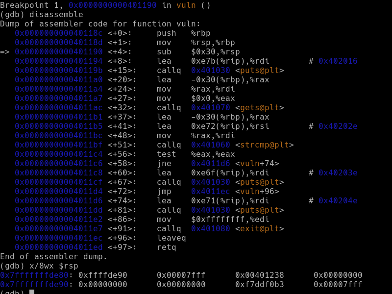

# Baffling Buffer 1

The following is a walk-through of a problem taken from [MetaCTF](https://metactf.com/) CyberGames 2020. I have no idea how long their server will keep hosting this problem. No copyright infringement is intended.

## Problem

After pointing out the initial issue, the developers issued a new update on the login service and restarted it at `host1.metaproblems.com 5151`. Looking at the [binary](bb1) and [source code](bb1.c), you discovered that this code is still vulnerable.

## Solution

### Examining the Stack Layout

The C code is fairly simple. If the user enters `"Sup3rs3cr3tC0de"`, then `"Access granted!"` is printed. `"Invalid auth."` is supposed to be printed for any other inputs. This, however, is not the flag we are looking for. It appears from the code that if the function `win` were to somehow be executed, then the flag would be printed.

As the name suggests, the function `vuln` has a buffer overflow vulnerability due to it's use of the notoriously dangerous `gets`. Taking a look at its disassembly, we can also see that it was compiled without stack protectors.

```sh
objdump --disassemble=vuln bb1
```

The goal is to overwrite a return address in the stack so that when `vuln` returns, control goes to `win` instead of back to `main`. In assembly when a procedure is called, the return address (the address of the instruction after `call`) is pushed to the stack. We can get a better understanding of the stack layout by using GNU debugger.

```sh
gdb --quiet bb1
```

Execute the following commands inside `gdb`. The program will run until it hits the breakpoint in `vuln`, at which point we examine 8 words from the top of the stack.

```txt
break vuln
run
x/8wx $rsp
```

Below is a sample screenshot of the output from `gdb`. Note that the program has stopped just after pushing `%rbp` and copying `%rsp` into `%rbp`. The instruction `sub $0x30,%rsp` (which has not been executed yet) is for allocating `char buf[48]`.



Recall that the stack is "upside-down", i.e., pushing to the stack *decrements* the stack pointer. Therefore, the most recently pushed data are at the lowest addresses.

<!-- TODO: expand this section -->

### Crafting the Attack String

We have located the region of memory that needs to be overwritten. A couple of considerations must be made for the attack string.

1. The string must start with the access code, otherwise `exit(-1)` will be executed and the attack will fail.
2. Memory addresses are 8 bytes, stored in little endian. This means the lowest bytes must be printed out first.

Here is a table that describes all of the contents of the attack string.

| #    | Bytes | Contents                              |
| :--- | :---- | :------------------------------------ |
| 1    | 16    | `"Sup3rs3cr3tC0de"`, ends with `NUL`  |
| 2    | 32    | Padding, any character sequence       |
| 3    | 8     | `0x00007fffffffde90` in little endian |
| 4    | 8     | `0x0000000000401172` in little endian |
| 5    | 1     | Line feed, optional\*                 |

The string that needs to be typed in contains unprintable characters. Therefore, I created a small C program [`mal.c`](mal.c) that outputs the necessary string. \*Recall that `gets` reads input until newline or EOF is encountered. If it is going to be piped into `bb1`, then printing line feed is required. If it is first redirected to a file and then in a separate command redirected to `bb1`, then EOF is implicit. The latter should be preferred.

```sh
gcc mal.c -o mal              # compile mal.c
./mal > attack                # save the attack string in a file
chmod u+x bb1                 # grant user execute permission on bb1
echo 'dummy flag' > flag.txt  # dummy flag
./bb1 < attack                # run bb1 with attack string input
```

This did not work locally on my machine. Running it with `gdb` told me that `flag.txt` did not exist. I suspect this is some kind of binary compatibility issue. However, this did work on the real problem server which is good enough.

```sh
nc host1.metaproblems.com 5151 < attack
```

```txt
Enter the access code:
Access granted!
MetaCTF{c_strings_are_the_best_strings}
```

The flag has been captured! I hope you enjoyed this demo.
