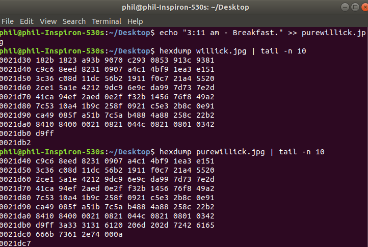
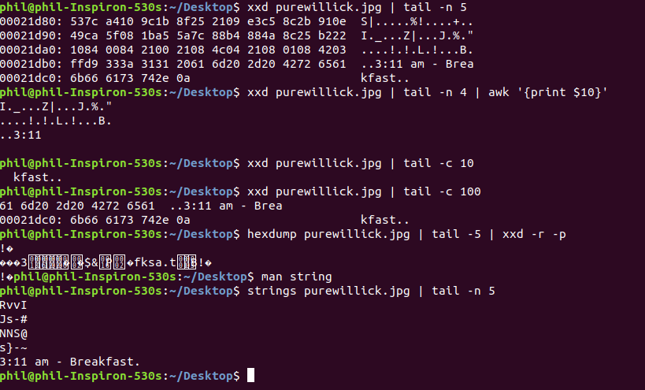
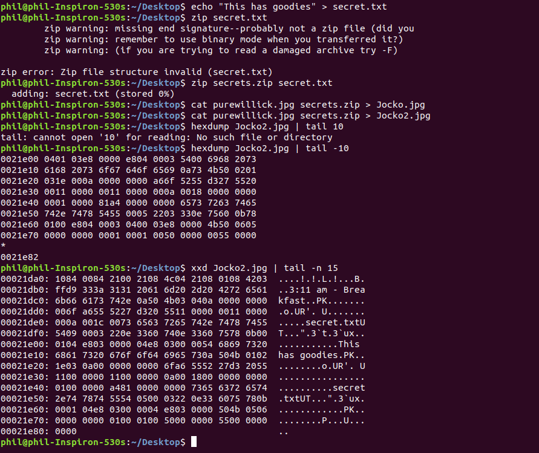

# Sig Mal, Week 5

## Steganography

**What is Stegonagraphy?** 
In essence, Steg is hiding things inside images. This can vary from text, files, or even running code.

Exhibit A: The untouched image
==================================

This is the unaltered image. I made a copy of it called purewillick, this is mainly for the next step.

Exhibit B: Hiding a message in the image, and comparing the pure images and the edited images.
==================================

Notice when comparing the hex from the pure image and the altered image. Of course, when we use something like xxd, it will display something like this. 

Of course, after playing around with some syntax and forgetting strings is a beautiful thing; we can actually get the hidden text.

###**Naturally, this works for hiding files too.**
Let's say that I have some data I want to hide, bank account details, passwords, the works. While I could keep that stuff on something like a usb, I could also be very noided and decide to hide it an image.

So, I ended up hiding my secret file into this new png. I simply catted everything together. Now, I have the graphics for the image. Someone can view and thing "Wow, this guy has a funny Jocko meme, though me personally I'm more of a fan of Goggins." Which is fair, I love Goggins too. Anyway, what said person won't know, unless they want to dig a bit, is that there is a text in there. So what if said individual was smart and wanted to dig, or alternatively you just want your files. You can actually unzip it, or view it.

Do note, I acccidentally overwrote one of the Jocko files, so I made a Jocko2. Pardon my innaneness.

The above image 
