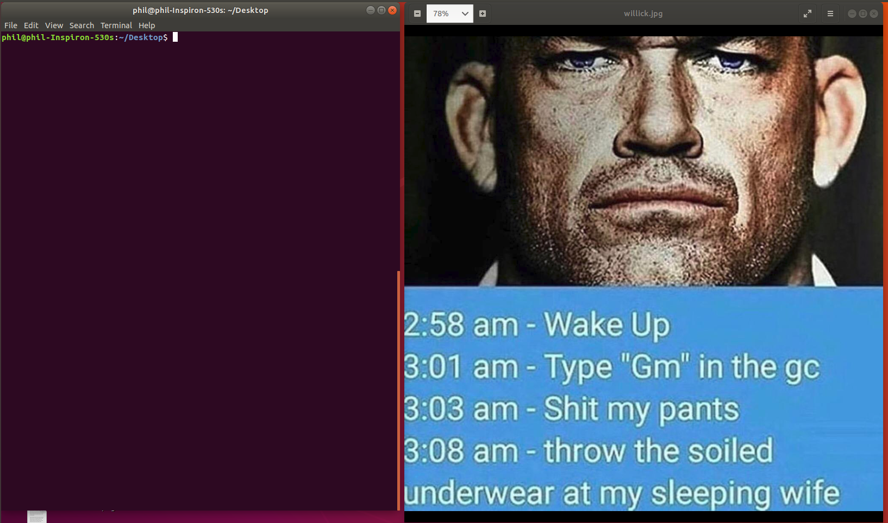

# Sig Mal, Week 5

## Steganography

**What is Stegonagraphy?** 
In essence, Steg is hiding things inside images. This can vary from text, files, or even running code.

Exhibit A: The untouched file
==================================

