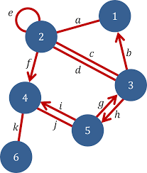
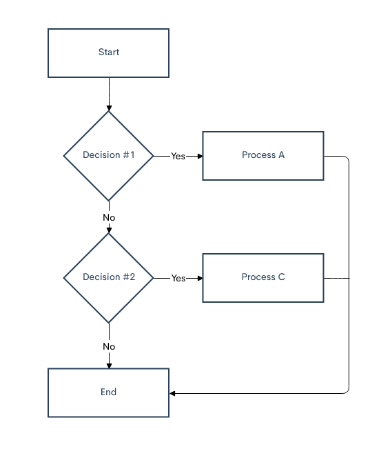
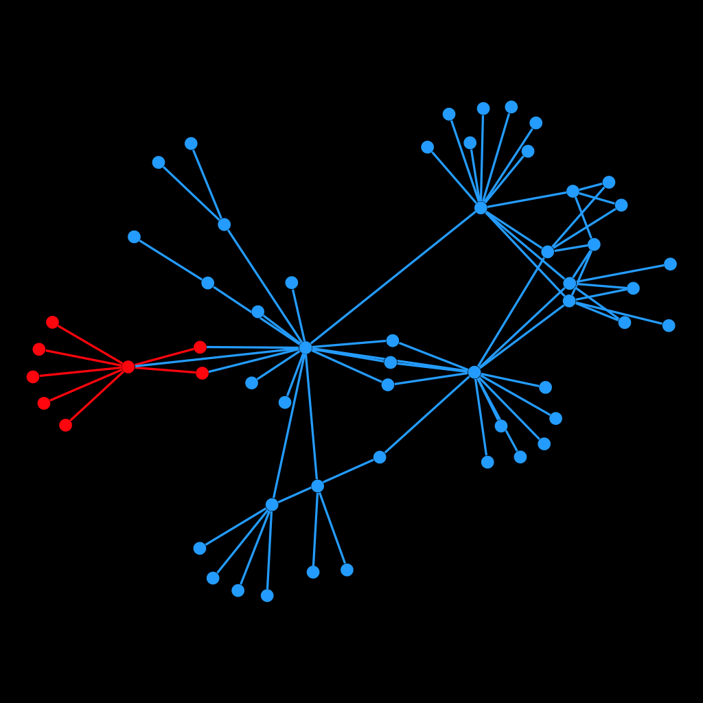

# Graphs, Graphs, Graphs

---

## Graph Theory
<!--  -->
<p align="center">
    <img src="https://raw.githubusercontent.com/AOrps/SigMal/main/educational-material/4sem/img/w2.10-graph-theory.png" alt="" data-canonical-src="data:image/png;base64,iVBORw0KGgoAAAANSUhEUgAAAM8AAAD0CAMAAAAL4oIDAAABJlBMVEX///83YJLAAAC9AAAAAAA0XpG6AAAxXJArWY4eUookVYwoV40ZUIkUToguWo/9+vrgoKD14uLw1NT78/P57u7syMjy2trb4OjWfn67xdXDISHck5Pem5vZiIjqwsLnubnQaGibq8JhfaTNWlrTc3Pkr69Scp3s7/PJ0d16kLDip6drhanJSEils8jGNDTh4eGKnbmxvc91dXVcXFxGapjMVFTBwcHIPz/RamrUeHjl6e/BEBBra2vQ0NCzs7OBgYHELCzCHBxNTU21tbWhoaGQkJAcHBw1NTVTU1MqKiqjo6NDQ0OBlrTX19cARYOVboeoHDFtPWdZVIBGWYmHh6OUNFBuSnJiTXepAB+HPFy6W2WOWnWEI0qAYoJDR3qYLEdjY4vCrLfG9j4gAAAWHUlEQVR4nNVdiVviSBbPQS5CiCCKeCGgHCICNl54t9rt2Hbv7uzO7sze+///E1uVA0jyklQlFRx/33zTBDCpR1W9+73iuN8vzO6g15zwfLs/qk3fezCpUWsaeVWRJJ7npaKuKaMPTVJD0zElC1CNZvW9R5UUNd1PDYZi9Mz3Hlki9AtBYiwU9e57j40eHb4YQg6CMXjv4dFimgeW2hza6L0HSIdONDmIoMZ7D5EKfAw5aMnV3nuMFOhH7J0ZQZ1UjzDXVjYuLja26hVGY45ALYyzLUKapHjCwZEsOpA3t1eZjRyGTkAOz+fHSe9/KIoCgkUO/lfeyFSiNVQieng92e1Lm6JFS2tnZWVr/0G2rupsSfBAi2UGDj2JJqgu4/FvrLvXlRUBUSRfshu/D2Oy5Uaxg25PXh7d1yuIHP/6OsRT1GJJwyLahNPD8wUy1fTzM/c957w+wLNT9n9j9VgUxD2GNCygY4BjV4D3VCKh+voVzdBP9ut1RM4VxM5aiKAVhlTM0c1DW0UZAQRJbZIbfjl5/fTiCKsrNDswdz4SBbnEjIgFQNyt0OCqEJkGwf3M3NnQfb2FBr0e8j3EuM/ZUOBFPzgRk2mjA06bRmCtmjk0N0Nrfky0qHbCvrcmC/IaOzJmmATZgcQbVZCePIkh9O365vmb9WoF0RP+vVNBOGVDggeQTcprMD06kVL6dHdmv9gUxK3wr5XRYsxA8wHZWyp6XJTQiorSPq8E8SDl4AFomdFzIAr3UZ/viOJ+mpHDgMgJo4do/yyOdyPq83oMvWG4fe2chX/apNg/GpXvqiWIh1Gfr6MNRHM/G8PcWeenXPjnI8CWU39Mqz8guUSl5x8J0Wp0BdFDbzjk0NycnIR9atb/EJQ/6hjNQ3UAEET15HNB3I36fBWJVKobYpzhqfn2CH62vn0uC38E1pWaLxTyQXKUN6pHn0bzr+n4Tz//ecJPmm9jimWMp8bMDQPvr9YvbGtRgDRPGHk6n8i+GC5+pg1Js+0UCfvJtTdSTvPyzHF3/u1T3rqXbdNXFC7/QkxQgYocblsUQoycatPwzr6kaBOyH+vkhXu9+8Y9zd6oHLQcM16Uj1aQtjiFDYYginTLjVsLUXfMvgEp79qEZNl1vuRuOrkXh4+s7Vj2O/ZJXG24m7VJOEEGbexEFkRA4+xqIc+TDCqnZenw1F1kcutwwfaokk2Q0qMkh7sQAY2zYYTbw/km4Z3N3Q3BnZjNHf+P1iNy8NA7FMtIgfPb2j1Qv3Khkrgo1reP3IkR9w4gDZHEI6Il8O6cC8Km9503SO1YgBJD0Gp9f7b7j7cCjgkHBCtO7dOTg90HoscxNYicHes5EUuuvHU8m5j9epStMY7z+Mb9biHYQCxue35JslPzcKypcrA3Z8vbYUb8DI3oH07hE3poj5GONje5JRLXGMBG13Y23d0vbOwSDWUQwXbQNk3qcDaxh+fIWRoNIs+lz4tUOmzBbDkGXUjI2Q/QkuwdlyDsvZa3MEUhnr4AtJnuE82WY9Bpw2uumISzLaCFXaRy66A0IvT7O37l9ZU4thyHmhIIO0pF4y1tcKPujIqQHGw2mkRsmYCidkGdLzupmNdG6cJyNlaw4vsLKTk8/1eBjC0TYDpoFjQtj6DlJyNmiQdrO/d/g5ZWsQiyIVK2TIZOtYswXYu0LqmhBEdeaDcaTUhj+JWULdNgJ6B8pUEnyG20jjkacIBdr6bjQCF4CHemJwDgMCpwvGp0uaBuQhaYoUQJR9bYhTSgMGBBwkHMID30pgkBDi0Ww4ygAawcGGYt+IFEagfR4EiwBDOr/Ac4iq4NTCDVhixwRgdTFpgSBNKjv4E6ahbzUxcFB2yCGpB7UmlyE4CN80oKhTEMFxY9SN8XrphIAmCb8BLX1tV28H1aTxIJECFoB7VwOsQDC4KqgPzpdvv9PhDhUNnnD5aRZWkFAFaQzXzE4IZmwFpwd32QX9PFZYiwg52bIs6F2EIWCIs7BvM2pAIGYBVROmJJ8ICd6aeW9X94ykTvIU17Qvgz88wEO/YZ7oFOgClJlp2N38RLxpFiU5TP7U3E7p7EiULSFTJoQxMXkqFihdYQL2CnktZinW82lL9cWTlyGeT3HMWEQOkApG5AMDrcAc6REwXm4fwtUdhjdzcyx79uGQvb2OIWH9ialKEhnIR4I2BxrlQyd6zMzGOWNiVWStlZDBxJnjcv/d194OolVonlI4ZGJXfMNicFMLr95PwiyHuuSl9pWRTtscvZ3hHFC2Y3Q6jGCKH8P+yEZlf8rB/Jnuu02BUT5AhEoRpZKWGMubV7vG3kWWTcf50Oq7McqcenGyZ37ExCvfKK7bmu+8SP/zoVNmdJK7mIJCAqjEJCGVrT9cVaCfUL4udAZCaONkQ3wpZj5uCrtguBWIaUlxYTEGzxs7nrvWYgjpDZfWW9uPmS+l5zdPse0SrpBX86hSN+zsve61BxFMyAgVFxN9Dz8+1PQN5MUnT++TOv5fU8+k8zmgMgtWF132LWp6WQ60WcXD+Rjk1wsqReXm646+tkgwdQRmPrVGsI3dA0jZItfi4q3uugOLq+47hPhA/eF+2c49wTmiPSP4rHFpFptX4ueuprXHHk3crDiPS+AJwsUOtv8O/ACMeEmrstfsRIcUT1M5fsLMJbnFKdYyOCOCrF0ArviXPqg+Lo0zPNo0Urqwjn0blVFgxApXc44qjuu56JIzy2m++kd9uzkvZzX26evrALMW3Q5Spv2eJoFuH2iqdh7vpzaEZpAIciLpwYUvwCBLiKyZX1I0QcOdfmd4pfOllacTQqManz0J9cWMy6RSKOoiGCaXkJYQ7xT4mY5mbsV/0IEUcXtNZRK7Ksgg53d5/wSt8TwwtpIlC2xdHOTBz5xBMZVkSBhQMb4/aFM7ESnXjK1zYhcUT3e5fZbSDH5lhPlBlvoy74xJFPPBFABkoUk2D4nDuxNIwVMU2tmS1+RL84IueXp4xqETuPuc7QueF23JejYIuj+zXv9SbpEmbmln9yFK3UE25u2OLHdWX5xVM0mLnlX+y0dhZeSr84cq7JxBErt7yjz5LZCnEonVoU7K96r0nE0Tkbt/zQcUGQ2gpx8Isj/3UoGLnlb227azW1E9nsOMb1ri2OZszFL55CwMgt75RVpfdRDr/MLLgDvzgSCMQRI7d8zi6rorQVIHy+nb9esZj1lU8cyZHi6J6FW94182ltBQBeZ86WDImj+whxxKJU9OmrPYgEtoIHN9cnzz4HyKoljuaRFb94CoClWz6RrTDH7Rckxz77363sgeKoFbJLVtFntXFjNBoNamn7p+1FFN3HwyrfhxwgIeJoH4y0VP/E87quFouqqmtGc5zGkZDOPMTdL0L8TOVjQnFUm3ijUIpu9JL07Sth9SqNrcDZLsBhWGhg98ErjvziyUKXB0JQSbrclWX5MLV1iJfaS3howBFHB77rBXHUK8DRmqJG26HrUBSOU9sKz7nvJ49fzsI9iH5x5L2e8qEhdqlAmXVXsho42LbCbuJIzvOdyd3dRn0jII7m19WoqiBep0zzxKEK2/bYkeUMWjm48Iuj2XVcQgclQZeiuGHZhrgMjZnLCIIrjire69h6Kp0q8buOJCluIrCDyLlnT4QHVmRFkC/n4kgU4qjhcf40xTNW7RRo3BvpOAsavAiII6jAJQCqIuhjJwN6GeRwfnEEJOQCoEpl3xKXSQ7HefLOCNMJacRQWVwuOZwrfh52uS5huidVX0WrxCOTtlWhcAP9YN8XcIIokqVbSyeHc/LONom73NEU6yBbeOnkcDjvTPgNXFsgQRTZ3yX5PchBWP9vcNyqxk8KQLeefJyFVx2P+s1mszcaT7PoKEaEYNsxtdGpVrm3IEHR1RO1vqHpRUWSJAXZgnzvfXpPA4mRBW5k/KgB/bui2vI09LwnlUpSND6T4sUYAO0GpbaCc4lpqt1qOqQB5vnlzxHUjkuSVAPsQxgigcxmiIYhGVnUL0YCqqZSmgOz8QMaIHiLqhreB0edsCgLT0mP1G90ObDoH7pDN9J2kvLLPQgBbP+G1tsAKkKA1lu0ZYsJWuoMQe1HNQkXJPaCqZ8AP+jEan8KXfO1lICqx6dIor4B1XsQvyYoJSlmUQQcCkj+dEYNbhTcWHpQngLfCiJlHw86AG1jtX5jxAMDDeo7ZC3LJLr2hekAlcMrRZADB/VRwo5l6hJPdSBtLgPZC4QNy3Bx/fIISmHPBVlgCDKoAw5Fl7B6TwryXeLCTOBvswNh9V6wSSQoi9G6BO5H0oCaFcgcIoA7BOrQil2pgHmb7MiAhCCp3uONoHEKTiyyNAAHWCaNQmCUtg8IqvfyQCcWiLtJExOiJ9UhIhQo71zJcnkao1PCXftA1c3o9EAHJUlH+pRwe2HJcTo/UsEgZy/kJ9YbXR6kJ2sVoeI29RRwbDCGIBX0XQP0oGWVb3NtQOXQMrUayk5bP8vLbCUJVPVw2ajBmxmgpzDtGROOHwA6Yab02Mm/D1cWPXYE1QzTxRQjhNdOA/QgLjadTrkpIGiz3T/7sry5VTqw5sjNsTF/gfyiSqEf9ssC/EAxtMKEmwCLV8uUHm6tZB9wg+fHeetBEH7j8x7hLumRpwaCclhqg/Ing0ZIfpKwM35nlpB4bB2c0n3La7peVBRF1fNGexC56kFNVq2ivRh4t+haDKuV0voaqyqJ4c283LGMC9TMlptxfTSLRE9rjVGv9zYad+NYLNz4RIIOrpD+sXd6vinIsnW8lrzHhJyfns9mDfNLotVTTHQSpHHoNvLMAQhwoFICG1XdCwsQr3wDS1Qe+vUV12/arytYjq7PSn72ETkJyuuJG9NIzTXZpUUWH3zp4MNE1ZQ3VsP8V+s17riPD305sDJtcE+hRMdCEXfaQbbGni3wWsxaHNzhqbHzMU3Ey6w8Uvtki20xYXCQ2FZXrTN1LMj7forOclRliy5wAtaTvX1w82Ars6okCBXr6Kv7JHfkYKcwMD1YIlvSToSaNiQr6L++5r5/wkl/C7wMA4uhpJ3STKIj4Bxr+wg9p/4QTCXsJCvoH+a+vr7iRG8vL7M2auIuF0QnKDqnoVRk/Ny67KfojKaKeYZnLBq/nln96xZ4GT6YLE2nwX78ipP+5Yx9RbTazDuphLMVckdeUjqHleON/7fh4WVYDKXr1TmJ9Vn9LLizgYSQJXmcwisn3+bbLZdgweWevj8i7rYlLnats8RQyooj8AS7OZR/Ww2Ht/CQS7K7ce3sFFs3+Xr9KYkxcXN2g34ZeTGrxnTEUDqCJlGHqupNd33h2UDywV0b27Pyvk5kUmUkfE0SNx0xlBJgp2F769ipp/PZ2DueL+6t1M1PfLwMi6EV7vExtek4CGnhPk8N3oaKLZ0MoqukP6mPlzli6IxBP5dOP9jIhfd2PAdnY9Wm6CERRY5K7cIVQ2dM+rlUe8aiB0JSdOPNO+/wbNgpuQsNa4jh8LL1Q/tH23dP8nxm1FvDHOPQmKSqyBLU9B6Q/eeM3ddcp7LvS6Mmg6NSr8o2u8YqtZ0z9O3mOfeSjAQ/Vn79zx8Gg8G4G7YjVy+hsds1L6RFpQ4clbouCg/oalueqdS5kyF0TlUS7AtCXLa1MxvHXoqcjgBHIRQhk/mt1++9NWqzMIWrUu9YbZ0WVOph7gZphIlJ8OCcpMDMSfn2zYZLUbDSqjpSHJdGUdULun0A10yltvrW7S6o1LjO5vFralIsiGTluPDYncRwX6VVzZ+JV8R5W3OVGq2zSnlRDF0js+gkkUEVAC6YI9PU10+hsZcDFFUnUBNwXf+Pq1LjKomSRwxhYyp3w8RbTlP+7Yx9z0cRrrSalzKHNVzj+b/t2d9AKvuxR6Xu4DK13N0nFgQdUFUw+cbuwGmLhI1ycxJui0hO3lbL9rGsc+tb55Zya51gOYSPFaRF3Dmbfjhjv/RSZNeOyZdDJUpxd/K2bKfExg4O/KQqDoUQd85mEM7YfQ4Fyyh/iOy/iA/3mdpHLQi2WwJphwxJsXCVoKDRblLlr02si2IkMRZBqjnrfY8PQTlkfqYvdfF3B29bv/lt47/xjhaljY1t63Sai3oG4b8SdXuYM/t46MO5wediHHPcm4X8+BhNzNUO0065c+wmr29eNL8xzJBaS/8MXZ1vsz97/fnO5p3btM0gXr/NHYleg4/QT5lNVsN3R/uLOgYVhkcNXjD4gkcEhID+aEYC3DraH5E2uojvXjV4bvCRnffGZ5RYd+IYhCJts53Xb743XGN1QkgOkqpsSPAAaYBnuc8U2qiL66AabBl8f4QCYghq8H2aGitC4EYFd89JmhGBcYXKPliSNEFoBAPNGRzwdJMzr/HA6LRRzlGFAZSCstQ5hwY4eYN9LvTzZ7vLB602Gh5XCM6O0u+gGQIOqMkgr+HzK5fDHSRbtM3J7sKa6ga5NaKnAMaZM8hzQsR8eua+44NQqLTRTpgTBkjZR/T80MDjlZkncmIh8ph7GdJqo9fXYT4lII8GbZMp1+lBeVtpu7b4YeIJHybRRsMA5QkqvGYMoIQU5vS4SKGN+hBWsmJAufyZJQ6vsDsxBNDedBXTAxRfZZZ5f0mtjYYimDesdxtGfgLUjkg6o2cGcMTugI1gGYFe42pjbhA08rI48M0GtTYaDmCb6Gq/rwLsTc/iQEuMVWptNBzQgVUSLE4zY29MT6wirKjA643ZM32g1kajANVYgchsuWFr+TL+W6Qgc4dkZG9boNZGI0FocGdYx7bpnEbBCET+HUnLroiA8XlVcQUVFqgbn5GDnTbq4C1+xUE1LwxgHeL9v1/9Obtp0Y7L21IyKCmaDvqadcg6Xu/sDlm3EJOIJinMN0+tbSy2PijmtRFD/hkVnsMGEWtWXZMCESdJ9aTspEU/vJI0z9qv0wnpsVEsMGQ6YXlbksFaL+gC+VTOszSGbKfTBChStCZro3QQVUCoThiuuWrf8NR3oCXdZO7jbURnKSs8S9bTGTQNTVcxdC2uhCcRxnHCm7loqNYGjVEjfUth+ObxukhGojsbRKXzulhqi410IKr25gtL7iOUGGQtQ5ZZgJ4OQP8UEFT9Pd8PhNODFAXKJsbvBPLD3DM4mz4DkHZAgfpz/A4Bn00v6UCdVlQ3v98NoPZqvD6pmUBoRnrvwRIAaoGSH3EjqCZ4mV2ekqIPtjrhIXKy8y0zBBAy17iGkQfbQb5Px04qBEeNpqddq44Bvqd/AAYHjHrM1ZpNE2B8H4EeIBRYM39I+gj85L1HG48gW0b0FHDYL/jJR9g/wdBmccRpeH6CLG6ZPbiSAlDftE5Xb3MDIJT+3oMlANQiTR1Uuz2gt1D2LVDSA8pUlfQ81Iwog1S7DEB4GABC4QOoBxSh2qW2GEwBog4O/JI78qUAqYGaWWINa5AtuPwHmR5k0pH091xWf0EW6BM4SD+It8pGfPtIlkGt7NGJKW3jtQ8hSueYRhNUWGI7ZTbo8BF7yFhi82FmCI09Fz+C2QOgpgPlK/gEiQ/gpYLR0Pw2XLEQ1W7x949x28iripXYKSm6po4+ktQBYXYbvfaE59v90fgDTs3/AfWlx2Q9Nr07AAAAAElFTkSuQmCC" 
    height="300" width="auto">
</p>

- Simply, a graph consists of nodes and edges. 
- Nodes can be called vertices or points. 
- Edges can be called links or lines. 
- Graphs can be undirected or directed.
- Edges can have weights. 
- Meant to represent some type of data and it's relationship within the data. 
- Loops can exist within graphs. (shown by *node 2*)
- Notably used within:
    - social network analysis
    - study molecules in chemistry and physics
    - wreck budding software engineers on leetcode and/or interviews
    - Representing methods of travel or pathways

### Implementation
- Graphs are a set of ordered pairs. 
```python
# In python, they can be represented like this
graph = {(1,2), (1,3), (2,4), (4,2)}
```

- It might begin to be more and more time consuming to write features into the graphs like attributes or keeping order, so luckily some languages have some implementations for it: 


Python Implementation 
- [Networkx (Network Analysis in Python)](https://networkx.org/) for Graphs. 

Julia Implementation
- *Why Julia?* Normally you have to choose slow but dynamic python or fast but more complicated c/c++. Julia is the space in between. Where you can have fast and dynamic Julia. 
- [JuliaGraphs](https://juliagraphs.org/) for Graphs.


---

## Control Flow Graphs (CFGs)
<!--  -->
<p align="center">
    
</p>

`A Control Flow Graph (CFG) is the graphical representation of control flow or computation during the execution of programs or applications`

### Generating CFGs
- Lots of programs / features say that you can 'generate CFGs', but it is either really buggy or doesn't really work.
    - USE **ANGR** or **Ghidra** for better Visualization of Control Flow Graph
    - **BUT DO YOUR OWN RESEARCH**
- Graphs can be generated and put into many different types of formats: *DOT*, *GDL*, *GML*.

- Note that [Generating CFGs], [Converting them into Graph-like serialized data] and [Rendering / Visualization of Graphs] can all be separate things. 

### Visualizing a CFG

- A program binary might look something like this to the computer. 
```txt
# hexdump <file> | head -n 7
0000000 457f 464c 0102 0001 0000 0000 0000 0000
0000010 0003 003e 0001 0000 1100 0000 0000 0000
0000020 0040 0000 0000 0000 4598 0000 0000 0000
0000030 0000 0000 0040 0038 000d 0040 0024 0023
0000040 0006 0000 0004 0000 0040 0000 0000 0000
0000050 0040 0000 0000 0000 0040 0000 0000 0000
0000060 02d8 0000 0000 0000 02d8 0000 0000 0000
...
```

- With Ida Freeware, we can see a partial CFG. But this has some complicated Assembly (and I can't easily parse out a Graph from this. So for me this sucks!)

<p align="center">
    
</p>

- This is what a CFG of a C Program, rendered in Ghidra, might look like. (It looks like a graph!)

<p align="center">
    
</p>

```sh
# Fun fact you can 'generate CFGs' from gcc
gcc -fdump-tree-cfg <program>.c
```

---

## Visualizing Malware as a Graph
<!--  -->
<p align="center">
    
</p>

- Check out mal-net.org!

---

## AI Tricks with Graphs
- In-person

---

## Sources
- [Graph Theory and Cyber Security](https://mytechdecisions.com/network-security/graph-theory-mathematical-approach-activating-security-data/)
- [networkx](https://networkx.org/)
- [graphs.jl](https://juliagraphs.org/)
- [angr](https://angr.io/)
- [angr-utils](https://github.com/axt/angr-utils)
- [ghidra](https://ghidra-sre.org/)
- [malnet](https://mal-net.org/)
- [idafreeware](https://hex-rays.com/ida-free/)