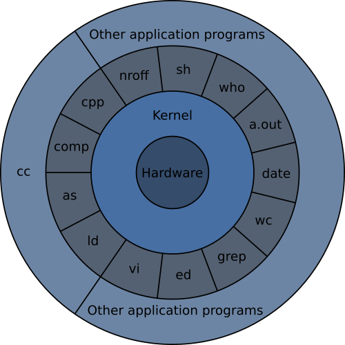

# Week 2

Introduction to Linux

## What is Linux?

- Free and open-source kernel originally developed by ~~God~~ Linus Torvalds
- Many Linux distributions, such as
    - Debian
    - Ubuntu
    - Fedora
- Unlike Microsoft Windows, is focused more on being developer-friendly rather than user-friendly

## System Structure

## Bash

- A shell is a program that interprets user commands and executes the corresponding programs
- Most common shell is `bash` (Bourne-again shell), which is a derivative of `sh`
- UNIX style pipe `|` and redirect `<`, `>` operators
- Think of bash similarly to the Python interactive shell

## Navigating the File System

- `cd` - change directory
- `cp` - copy a file
- `ls` - list files in directory
- `mkdir` - make a directory
- `mv` - move a file
- `rm` - remove a file
- `rmdir` - remove an **empty** directory
- `pwd` - print the working directory

## Basic Commands

- `cat` - concatenate files to stdout
- `chmod` - change mode (file permissions)
- `echo` - print arguments to stdout
- `grep` - search a file for patterns
- `head` - print first few lines of file
- `man` - view the manual for an application
- `tail` - print last few lines of file

## Advanced Commands

- `file` - Determine file type
- `ifconfig \ ip` - configure network interface parameters
- `kill` - Terminate or Signal a Process (Signal with a )
- `finger` - User information lookup program
- `last` - Indicate last logins of users and ttys
- `ln` - Make links
- `ps` - List processes and process status
- `ssh` - Securely login to another host on the network
- `sudo` - Execute a command as another user (root)
- `who` - Display who is logged in

## Developer Toolbox

- `gcc` - GNU C compiler
- `gdb` - GNU debugger
- `git` - the stupid content tracker
- `hexdump` - ASCII, decimal, hexadecimal, octal dump
- `objdump` - display information from object files
