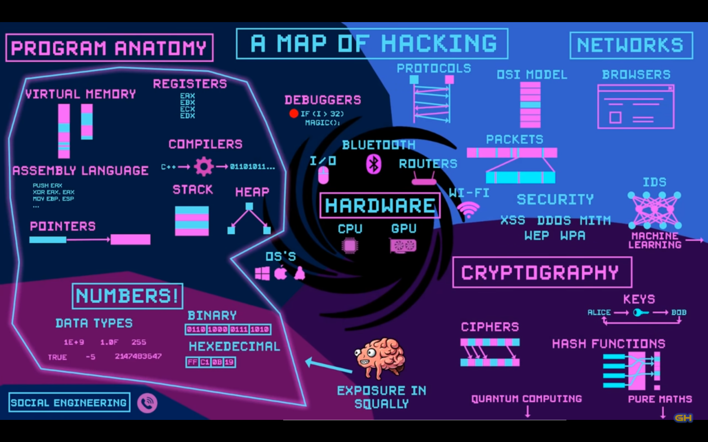

# Game Hacking

|SRC:
|:-----
| https://www.youtube.com/watch?v=hj4rhfnikVs

## Base Goals
* Memory Editing
* Assembly Editing 
* Hex Editing
* Packet Editing
* Botting

## Specialized Topics 
* graphics injection
* Resource Editing 
* Browser Game hacking
  * Editing  Javascript
  * Flash Decompiling
* JVM / CLR Game Hacking
* Emulated Games
* Anti-Cheat systems
* Memory editor implementation

Hacking Process
* * * * 
1. Find thing to exploit or hack 
2. Try to exploit or hack 
3. See if it worked

n.b. In the least, you have learned something

## The Web (haxx)

